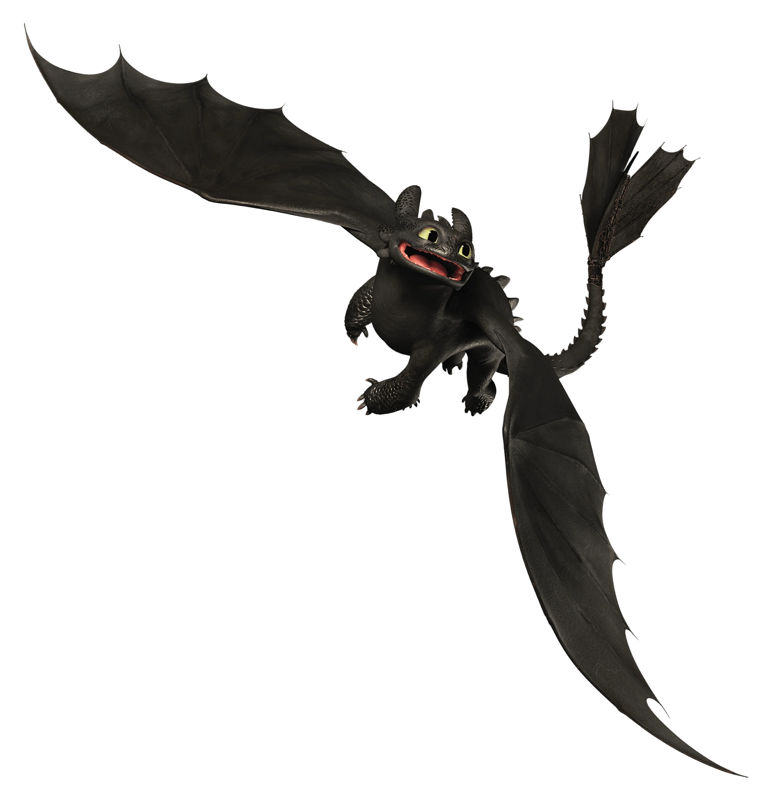
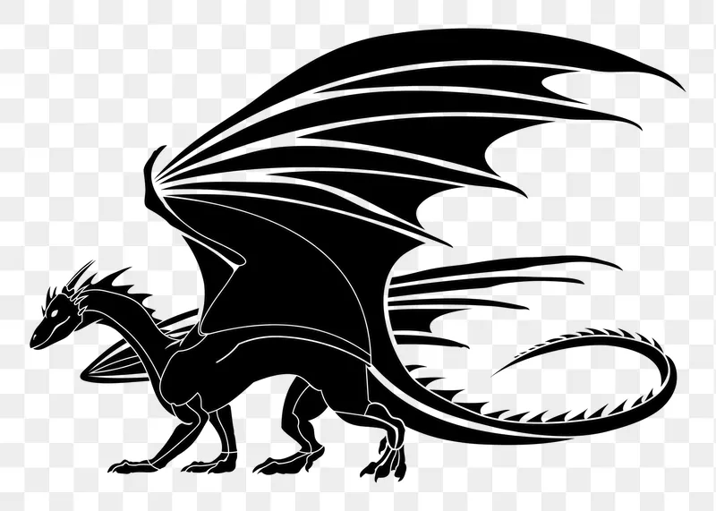

[My GitHub](https://github.com/siruiZHAO/Assignment7-DragonPhylogenies.git)

First, we need to load library
```{r message=FALSE, warning=FALSE}
library(dplyr)
library(ape)
library(Biostrings)
library(reshape2)
library(ggplot2)
library(ggtree)
```

<font size="4"> Import nexus file to R </font>
    
```{r}
#import data
DragonData <- read.nexus.data("./input/DragonMatrix.nex")
#check data
head(DragonData)
```
```{r}
names(DragonData)
```

<font size="4"> Distance Matrix </font>

To do the distance matrix, we need to convert our list object to a data.frame object
```{r}
#convert to vector -- unlist the list object
DragonDataDF <- data.frame(matrix(unlist(DragonData), ncol = 78, byrow = T))
#correct the row names
row.names(DragonDataDF) <- names(DragonData)
#check data
head(DragonDataDF)
```

```{r}
#distance matrix based on new data
DragonDis <- dist(DragonDataDF, method = 'binary')
```

```{r}
DisMat <- as.matrix(DragonDis)
```

<font size="4"> Apply trait weightings  </font>

It will have five steps to treat weightings
```{r}
#import data
weightsDat <- read.csv("./input/Weights.csv")
```

<font size="3"> Create a single bector of weights </font>
```{r}
Weights <- paste0(weightsDat$Weight, collapse = "")
Weights <- strsplit(Weights, split = "")[[1]]
```

<font size="3"> Convert each letter to a value </font>

we could use a custom function talked in the Tutorial with the built-in letters object:
```{r}
LETTERS # See what LETTERS is (see also letters)
```

```{r}
which(LETTERS == "G")
```

```{r}
WeightsNum <- rep(NA, length(Weights))
for (i in 1:length(WeightsNum)){
  if (Weights[i] %in% LETTERS){
    WeightsNum[i] <- which(LETTERS == Weights[i]) + 9
  } else {
    WeightsNum[i] <- Weights[i]
  }
}
WeightsNum <- as.numeric(WeightsNum)
```

After this, we have a vector of weights, which should have length = 78.
```{r}
#check length
length(WeightsNum)
```

<font size="3"> Multiply the weight value by the treat vector for each dragon </font>

Based on the fact that our data include missing data coded as ?, so we need tomultiply the 1s, which is equivalent to replacing the 1s with their corresponding weight vaues.

```{r}
#slice our list --- using [[]]
wtDragonData <- DragonData
for (i in 1:length(DragonData)){
  RepWeight <- DragonData[[i]] == 1
  wtDragonData[[i]][RepWeight] <- WeightsNum[RepWeight]
  RepWeight <- NA
}
```

<font size="3"> Re-calculate our distance matrix </font>

we need to modify our objects
```{r}
#modify data by using same way above
wtDragonDataDF <- data.frame(matrix(unlist(wtDragonData), ncol = 78, byrow = T))
row.names(wtDragonDataDF) <- names(wtDragonData)
wtDragonDist <- dist(wtDragonDataDF, method = "euclidean")
```

```{r}
wtDisMat <- as.matrix(wtDragonDist)
```

<font size="3"> plot the tree </font>

we can compare minimal evolution (ME) and Neighbour Joining (NJ) methods
```{r}
wtDragonTree <- fastme.bal(wtDragonDist)
wtDragonTreeNJ <- nj(wtDragonDist)
ggtree(wtDragonTree, layout = "circular")
```


<font size="4"> Visualize Data </font>

To visualize the matrix in ggplot, we need rearrange the data 
```{r}
#use melt() function to rearrange data
wtPDat <- melt(wtDisMat)
```

plot the matrix
```{r}
ggplot(data = wtPDat, aes(x = Var1, y = Var2, fill = value)) +
  geom_tile() +
  scale_fill_gradientn(colours = c("white", "blue", "green", "red")) +
  theme(axis.text.x = element_text(angle = 90, hjust = 1, vjust = 0.5))

```

<font size="3"> Plot the tree </font>

We will use Neighbour Joining (NJ) methods
```{r}
wtDragonTreeNJ <- nj(wtDragonDist)
ggtree(wtDragonTreeNJ, layout = "circular")
```

```{r}
#check tip labels
head(wtDragonTreeNJ$tip.label)
```

To check if dragons from same regions cluster together, we can use regular exoressions to parse out a vector:
```{r}
#remove number 
Country <- gsub("[0-9\\.]+([^X]+)X*","\\1", wtDragonTreeNJ$tip.label)
Country <- gsub("\\d", "Unknown", Country)

#group tip.labels
countryGroups <- split(wtDragonTreeNJ$tip.label, Country)
names(countryGroups)

#apply group to plot
wtDTcol <- groupOTU(wtDragonTreeNJ, countryGroups)
str(wtDTcol)
```

```{r}
#tree group by country
ggtree(wtDTcol, layout = "circular", aes(color = group)) + 
  geom_tiplab(size = 2, aes(angle = angle))
```

```{r fig.cap="Figure 1: Phylogenetic Tree of Dragons. The three dragons in red (Toothless labeled as Toothles, King Ghidorah labeled as Ghidorah, and typical west dragon labeled as WestDrag) are dragons I choose."}
#choose my dragon
wtDTcolMY <- groupOTU(wtDTcol, c(countryGroups$Toothles, 
                                 countryGroups$Ghidorah, 
                                 countryGroups$WestDrag))

#plot tree
ggtree(wtDTcolMY, layout = "circular", aes(color = group)) +
  geom_tiplab(size = 2, aes(angle = angle)) + 
  scale_colour_manual(name = "Dragon Type", 
                      values = c("blue", "red"), 
                      labels = c("other", "My Dragon"))
```


<font size="4"> Report </font>

Toothless (Figure 2) is the only Night Fury seen thus far. He is the most intelligent of all known dragons, and seems to have a dry sense of humor, similar to that of Hiccup. Except for no tooth, his tail is like Split Y.
```{r, echo=FALSE, out.width="40%", fig.cap="Figure 2: Toothless. Credit to Thorndrum: https://howtotrainyourdragon.fandom.com/wiki/Toothless_(Franchise)?file=Dragon+01+toothless.png", fig.align = 'center'}

```
King Ghidorag in Figure 3, also known as Monster Zero, is a three headed dragon kaiju appeared in film Ghidorah, the Three-Headed Monster. He arrived on Earth inside a meteor and planed to destroy it just like he had done to Mars thousands of years in the past.
```{r, echo=FALSE, out.width="40%", fig.cap="Figure 3: King Ghidorag. Credit to Astounding Beyond Belief: https://wikizilla.org/wiki/File:Vlcsnap-2021-10-22-09h36m21s456.png.jpg", fig.align = 'center'}
knitr::include_graphics("./images/Ghidorah.png")
```
Finally, Figure 4 is one kind of typical west dragon. Compare to King Ghidorag, Toothless is more like a west dragon and they share great similarity
```{r, echo=FALSE, out.width="40%", fig.cap="Figure 4: Typical West Dragon. Credit to rawpixel: https://www.rawpixel.com/image/6482373/png-sticker-public-domain", fig.align = 'center'}

```
However, when considering the evolving rate of different traits and based on Figure 1, we can find that all these three dragons are closely related. But Toothless and Typical West Dragon are much closer and have a larger probability they may share a common ancestor. The largest difference between the three dragons is that King Ghidorah has three heads and two tails even though they share many similarities in other traits. 


Thanks!


